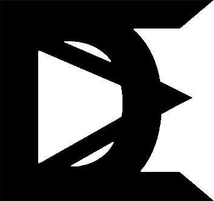

---

# 🕸️ D-MASH (Decentralized Mesh Messenger)

> **High-Privacy P2P Network / Anti-Forensic Messenger / DSP Overlay**

**D-MASH** — это экспериментальный прототип децентрализованного мессенджера, созданный для работы в условиях враждебной сетевой среды. Проект фокусируется на защите метаданных, устойчивости к криминалистическому анализу (Forensics) и сокрытии факта коммуникации.

   


---

## 🔥 Ключевые возможности

### 👁️‍🗨️ Blind Storage (Слепое хранилище)
Защита от изъятия оборудования.
*   Все индексы маршрутизации и списки соседей в базе данных (`system.db`) хранятся в виде хешей.
*   Соль для хеширования (`secret_salt`) генерируется случайно при запуске и **хранится только в RAM**.
*   **Результат:** При отключении питания восстановить граф связей или узнать, с кем общалась нода, математически невозможно.

### 🛡️ Tact Engine (Обфускация трафика)
Защита от анализа паттернов трафика (Traffic Analysis).
*   Нода отправляет пакеты фиксированного размера (`4096 байт`) с фиксированным интервалом (`1.5 сек`).
*   Если нет реальных сообщений, отправляются зашифрованные `DUMMY` пакеты.
*   **Результат:** Внешний наблюдатель видит постоянный "белый шум". Невозможно определить, когда происходит реальное общение.

### 🔐 Time-Based Ratchet Crypto
Асинхронное E2EE без центрального сервера.
*   Используется комбинация **ECDH** (Curve25519) и **Time Epochs**.
*   Ключи шифрования меняются каждые 5 минут. Реализовано "окно толерантности" для компенсации рассинхрона часов.
*   Полная изоляция уровня пользователя (Client) от уровня маршрутизации (Daemon).

### 📡 DSP & Audio Protocols
Стеганография и передача данных через аналоговые каналы.
*   **PCP (Phantom Call Protocol):** Кодирует текст в аудио-сигнал MFSK. Позволяет передать зашифрованный чат через обычный телефонный звонок или рацию.
*   **GVP (Ghost Voice Protocol):** Аналоговый скремблинг голоса (Frequency Inversion + Hopping) с использованием криптографических ключей сессии.

---

## 🛠️ Установка и Запуск

### Вариант 1: Docker (Рекомендуется)
Проект содержит готовые конфигурации для поднятия локальной mesh-сети.

1. **Клонирование:**
   ```bash
   git clone https://github.com/your-repo/d-mash.git
   cd d-mash
   ```

2. **Запуск сети из 4 нод:**
   ```bash
   cd client
   docker-compose -f user-docker-compose.yml up --build
   ```

3. **Доступ к интерфейсу:**
   *   Node 1: `https://localhost:8001`
   *   Node 2: `https://localhost:8002`
   *   ...

### Вариант 2: Локальный запуск (Dev)
Требуется Python 3.10+ и `ffmpeg` (для DSP модулей).

1. **Установка зависимостей:**
   ```bash
   pip install -r client/requirements.txt
   sudo apt install ffmpeg  # Для Linux/WSL
   ```

2. **Запуск ноды:**
   ```bash
   # Запуск первой ноды на портах 8001 (Web) и 9001 (P2P)
   export P2P_PORT=9001
   uvicorn client.backend.main:app --port 8001 --host 0.0.0.0
   ```

---

## 🧪 Стресс-тестирование

Для проверки маршрутизации и устойчивости сети в проекте есть мощный скрипт симуляции.

```bash
# Генерирует сеть из 30 нод, поднимает Docker и гоняет трафик
python stress_test.py
```
*Скрипт автоматически строит топологию, майнит Identity для нод, устанавливает связи и проверяет доставку пакетов через несколько транзитных узлов (hops).*

---

## 📚 Архитектура

### 1. The Core (Demon)
*   Управляет P2P соединениями (WebSockets).
*   Реализует **Blind Routing** (таблицы маршрутизации, которые "слепнут" без RAM-ключа).
*   Отвечает за PoW (Proof-of-Work) при генерации Identity ноды.

### 2. The Client (User)
*   Хранит историю сообщений локально, зашифрованную ключом пользователя (`user_db`).
*   Генерирует E2EE ключи из пароля (Argon2id).
*   Взаимодействует с ядром только через API.

### 3. Routing Logic
1.  **Discovery:** Используется лавинная рассылка (`PROBE`) для поиска пути.
2.  **Tunneling:** После рукопожатия устанавливается `DATA` туннель.
3.  **Relay:** Промежуточные ноды пересылают зашифрованные "луковицы", не зная содержимого.

---

## 🖥️ Интерфейс

Веб-интерфейс выполнен в стиле **Cyberpunk Terminal**:
*   **Login:** Генерация ключей "на лету" из пароля.
*   **Chat:** Поддержка текстовых сообщений, PCP (генерация/декодирование звука) и GVP (скремблинг файлов).
*   **Visuals:** Отображение статуса Tact Engine и соседей.

---

## ⚠️ Предупреждение

> Данный проект является **Proof-of-Concept**.
> 1. Аудит безопасности не проводился.
> 2. Протокол PROBE (Flooding) плохо масштабируется на большие сети (>1000 узлов).
> 3. DSP-модули (GVP) обеспечивают обфускацию, но не гарантируют криптографическую стойкость аудио-сигнала против современных вычислительных мощностей.

**Используйте на свой страх и риск.**

---

## 📜 Лицензия
MIT License. Created for educational and research purposes.
